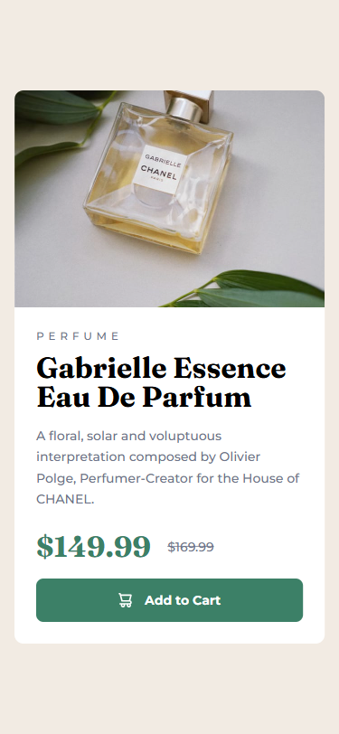
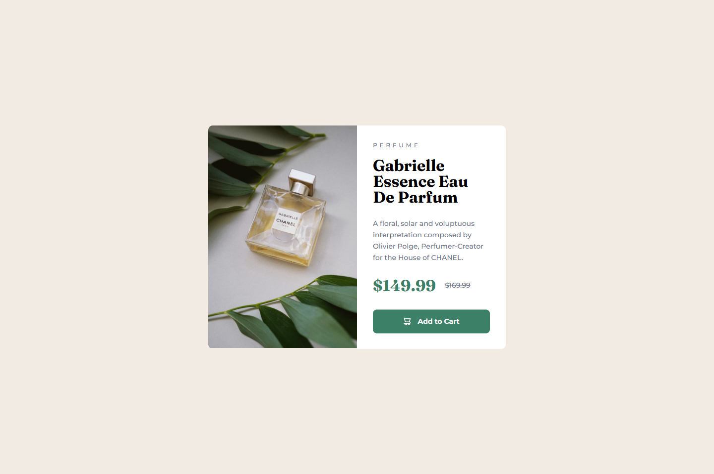
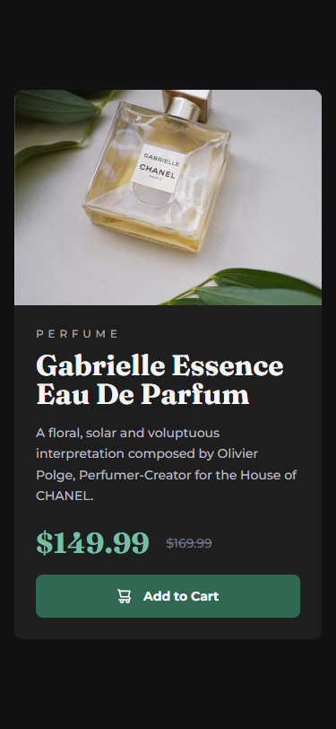
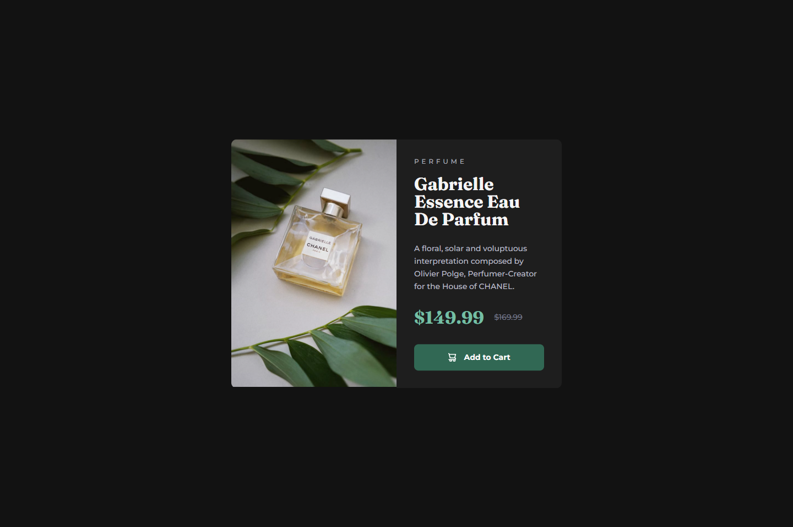

# 💻 Product Preview Card

## ℹ️ A Product Preview Card for a Chanel Perfume

| _Mobile Preview (375x812)_                            | _Desktop Preview (1440x960)_                             |
| ----------------------------------------------------- | -------------------------------------------------------- |
|       |       |
|  |  |

This project is a responsive product preview card that visually replicates a Chanel perfume ad. It's built entirely with semantic HTML and modern CSS. Dark mode is supported, and accessibility best practices were applied.

Created as part of the building challenges from [Frontend Mentor](https://www.frontendmentor.io/).

---

## 🔍 Overview

This site features a single, centered product card layout inspired by a JPG design from Frontend Mentor. It demonstrates practical use of HTML structure, mobile-first responsive design, modern CSS techniques (custom properties, media queries, dark mode), and ARIA for accessibility.

The project was built without access to a Figma file (premium feature), so the layout was matched pixel-by-pixel using the [PerfectPixel](https://chrome.google.com/webstore/detail/perfectpixel-by-welldonecod/dkaagdgjmgdmbnecmcefdhjekcoceebi) browser extension — a great exercise in visual accuracy and layout precision.

---

## ✨ Features

- Responsive layout with mobile-first approach
- Dark mode support via `prefers-color-scheme`
- Skip link and ARIA labels for accessibility
- Custom CSS variables for consistent theming
- Near pixel-perfect design using PerfectPixel
- Semantic, clean, and maintainable code

---

## 🧠 What I Learned

- Implementing accessible landmarks using `role` and `aria-labelledby`
- The benefit of using `picture` for responsive images
- Best practices in writing scalable CSS with custom properties
- How to match design mockups without Figma by using [PerfectPixel](https://chrome.google.com/webstore/detail/perfectpixel-by-welldonecod/dkaagdgjmgdmbnecmcefdhjekcoceebi)
- Visual fine-tuning with spacing, font-size, and shadows for polish
- How to declare dark and light meta theme colors for browser UIs

---

## 🛠️ Tech Used

- HTML5
- CSS3
- Git
- GitHub
- Netlify
- PerfectPixel

---

## 🚀 How to Run

1. Clone the repository
2. Open `index.html` in your browser

---

## 🌐 Live Demo

Or you can check out the 👉 [live website here](https://product-preview-card-fm-jiro.netlify.app/)

---

## 🧑‍💻 Author

Created by **Elmar Chavez**

🗓️ Month/Year: **June 2025**

📚 Journey: **3rd** month of learning _frontend web development_.
